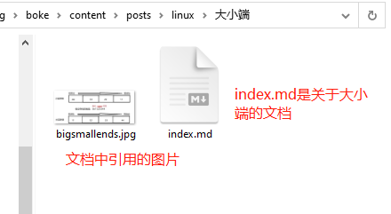

# boke

个人博客


```shell
# 设置远程仓库地址
git remote add origin git@github.com:xiarong715/boke.git
git remote add origin git@github.com:xiarong715/xiarong715.github.io.git
```


如果一个文档包含有图片，务必用把图片和`*.md`文件放入一个文件夹，保存生成的网页能正确加载图片。如图所示：


