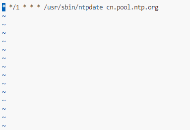
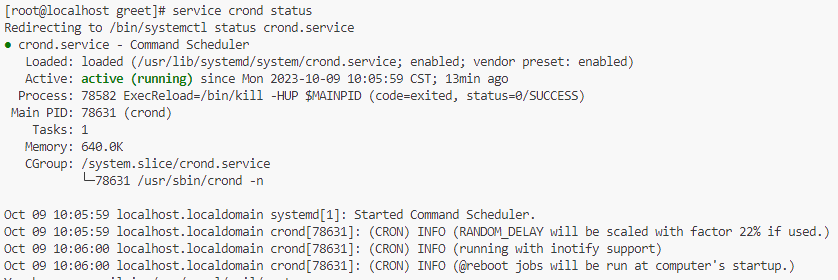

1. 系统时间不对的原因

   软件原因

   ​	虚拟机中的centos7，虚拟关机了软件时间没动。因此可以查看硬件时间是准的，但软件时间不对。用周期同步的方法。

   

   时区不对

   ```shell
   # 更改时区
   rm -rf /etc/localtime
   cp /usr/share/zoneinfo/Asia/Shanghai /etc/localtime
   ```

   

2. 查看系统时间

   ```shell 
   date
   ```

3. 查看硬件时间

   ```shell
   hwclock
   ```

4. 同步时间；

   ```shell
   ntpdate cn.pool.ntp.org
   ```

5. 将系统时间写入硬件时间

   ```shell
   hwclock -w
   hwclock --systohc
   ```

6. 设置定时任务，周期更新时间

   ```shell
   crontab -e
   ```

   ```tex
   # 每小时更新一次
   * */1 * * * /usr/sbin/ntpdate cn.pool.ntp.org
   ```

   如图：

   

7. 重新加载定时任务

   ```shell
   service crond reload
   ```

8. 重启定时任务

   ```shell
   service crond restart
   ```

9. 查看定时任务运行状态

   ```shell
   service crond status
   ```

   如图：

   
