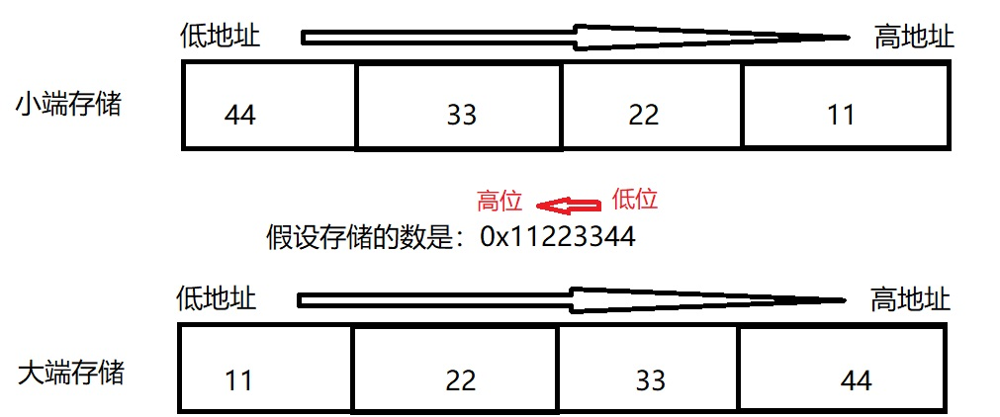

1. 字节序

   ​		内存的最小单位是字节，有些数据类型占用的空间大小超过了一个字节，那么就存在一个数据在内存中如何存放的问题。数据的存放可以是，数据的低字节存放在内存的低地址区，也可以是，数据的低字节存放在内存的高地址区；

   ​		如下图所示，图1中展示的是，数字的低字节存入内存的高地址区，数字的高字节区存入内存的低地址区；图2中展示的是，数字的低字节存入内存的高地址区，数字的高字节存入内存的低地址区；

   

   ​			

   这两种存储方式，没有好坏之分，存储方式与CPU的实现有关；

2. 什么是大小端

   当数据的低字节存入内存的高地址区，数据的高字节存入内存的低地址区时，称为大端模式；反之，则称为小端模式；大端模式，比较适合人的阅读习惯，从数字的高位开始读；

3. 存在的意义

   根据不同的硬件实现，大小端模式都广泛使用在不同的CPU中；

4. 如何判断大小端

   不管CPU是使用大端模式还是小端模式，CPU总能正确的读取内存的值，也就是説如果不需要大小端转换时，不需要知道CPU的大小端。当处理音频数据时，有时需要转换大小端；音频音质较高时，音频的一个采样占用

