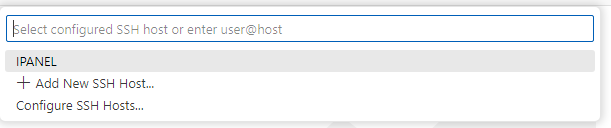
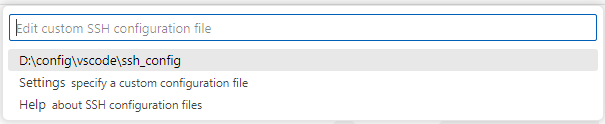
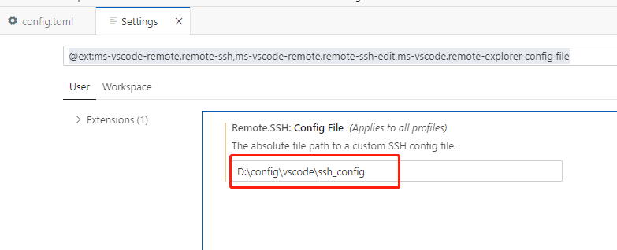
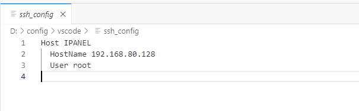

[参考](https://blog.csdn.net/ghomeway/article/details/111084190)   找到官方下载地址

1. 下载`openssh for windows` 

   [`openssh`官方下载地址](http://www.mls-software.com/opensshd.html)

   [`github`下载地址](https://github.com/PowerShell/Win32-OpenSSH/releases)

   

   注：[下载`openssh for linux`地址](http://www.openssh.com/openbsd.html)

   **记得用[Bing](bing.com)搜索资料。**

2. 配置服务器信息

   在`vscode`界面下，`ctrl+p`，弹出命令菜单，输入`Connect to Host`，选择最一个，会显示如下图片：

   

   点击`Configure SSH Hosts...`，显示如下图片：

   

   如果想更新配置文件的位置，可在想要的位置创建好配置文件，如：`D:\config\vscode\ssh_config`，点击`Settings specify a custom configuration file`，设置配置文件的绝对路径：`D:\config\vscode\ssh_config`。

   

   直接点击第一项：`D:\config\vscode\ssh_config`，打开配置文件，修改配置信息。

   

3. hello